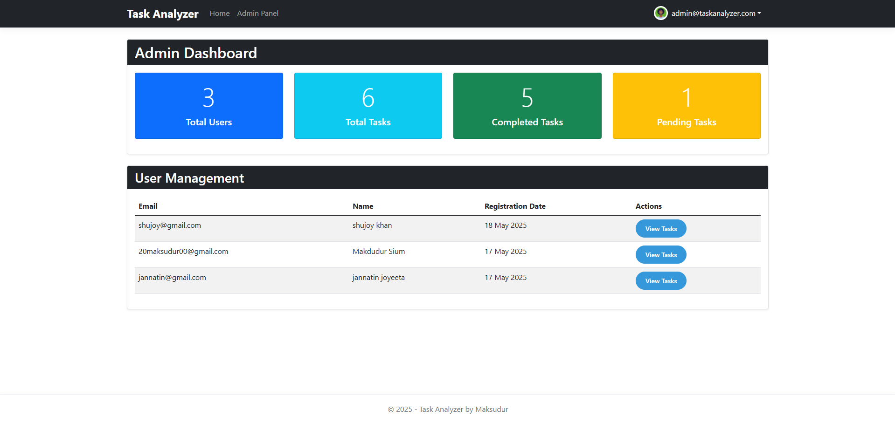

# Task Analyzer

<div align="center">


</div>

Task Analyzer is a modern task management application built with ASP.NET Core MVC. It allows users to create, track, and manage their daily tasks with customizable priority levels and due dates. Authenticated users can create their own tasks, view their task history, and mark tasks as complete. The project features a clean, responsive UI, user authentication, role-based admin panel, and comprehensive task management capabilities.

---

## Features

- **Task Management**
  - Create, edit, and manage personal tasks with customizable priorities (1-5)
  - Set due dates for effective time management
  - Mark tasks as complete to track progress
  - Filter tasks by completion status

- **User Management**
  - User registration, login, and profile management
  - Authenticated users can create, edit, and delete their own tasks
  - "My Tasks" section for users to view and manage their tasks

- **Administration**
  - Admin panel for managing all users and tasks in the system
  - User management capabilities (edit, delete)
  - System-wide task oversight

- **Technical**
  - Built on ASP.NET Core MVC architecture
  - Entity Framework Core with SQL Server
  - Responsive Bootstrap UI for desktop and mobile devices
  - GDPR-compliant privacy policy

---

## Screenshots

### User Interface
| Home Page | Main Dashboard |
|:---:|:---:|
|  |  |
| *Landing page with welcome message* | *Main task management interface* |

### Authentication
| Login | Registration |
|:---:|:---:|
|  |  |
| *Secure user authentication* | *New user registration form* |

### Task Management

*Intuitive task creation with priority levels and due dates*

### Administration
| Admin Dashboard | User Management |
|:---:|:---:|
|  |  |
| *Comprehensive admin control panel* | *User profile editing capabilities* |

### Additional

*GDPR-compliant privacy policy page*

### Database Structure

*Entity-relationship diagram showing database schema*

---

## Project Structure

Task Analyzer follows the standard ASP.NET Core MVC architecture, organized into the following key components:

```
Task_Analyzer/
├── appsettings.json                  # Application configuration
├── Program.cs                        # Application entry point
├── Task_Analyzer.csproj              # Project file
├── assets/                           # README documentation images
│   ├── adminpanel.png               # Admin panel screenshot
│   ├── createtask.png               # Task creation form
│   ├── edituserfromadminpanel.png   # User editing interface
│   ├── erdiagram.png                # Database entity relation diagram
│   ├── home.png                     # Home page
│   ├── login.png                    # Login page
│   ├── privacypolicy.png            # Privacy policy page
│   ├── register.png                 # Registration page
│   └── taskanalyzer.png             # Main dashboard
├── Controllers/                      # MVC Controllers
│   ├── AccountController.cs          # User authentication
│   ├── AdminController.cs            # Admin functionality
│   ├── HomeController.cs             # Landing pages
│   └── TaskController.cs             # Task management
├── Data/                             # Database layer
│   ├── ApplicationDbContext.cs       # Entity Framework context
│   └── DesignTimeDbContextFactory.cs # Design-time DB context factory
├── Migrations/                       # Database migrations
├── Models/                           # Domain models
│   ├── ApplicationUser.cs            # Extended Identity user
│   ├── ErrorViewModel.cs             # Error handling
│   └── TodoTask.cs                   # Core task entity
├── Services/                         # Business logic services
│   └── DbInitializer.cs              # Database seeding
├── ViewModels/                       # View-specific models
│   ├── LoginViewModel.cs             # Login form model
│   └── RegisterViewModel.cs          # Registration form model
├── Views/                            # Razor views
│   ├── Account/                      # Authentication views
│   ├── Admin/                        # Admin panel views
│   ├── Home/                         # Landing page views
│   ├── Shared/                       # Layout templates
│   └── Task/                         # Task management views
└── wwwroot/                          # Static assets
    ├── css/                          # Stylesheets
    ├── js/                           # JavaScript files
    └── lib/                          # Frontend libraries
```

### Key Components:

- **Controllers**: Handle HTTP requests and user interactions
- **Models**: Define the application's data structures
- **Views**: Render the UI components and templates
- **Data**: Manages database connections and migrations
- **Services**: Contains business logic and application services
- **ViewModels**: Tailors data specifically for view consumption

---

## Database Design

The application uses Entity Framework Core with a SQL Server database. The following entity-relationship diagram illustrates the database schema and relationships between entities:

<div align="center">


</div>

*Database schema showing the relationships between User and Task entities*

### Key Entities:

- **ApplicationUser**: Extended Identity user model with custom properties
- **TodoTask**: Core task entity with properties including title, description, priority, due date, and completion status

---

## Getting Started

### Prerequisites

- [.NET 8.0 SDK](https://dotnet.microsoft.com/en-us/download/dotnet/8.0)
- SQL Server (LocalDB, Express, or standard edition)
- Visual Studio 2022 (recommended) or Visual Studio Code

### Installation

1. **Clone the repository:**

   ```bash
   git clone https://github.com/Maksudur20/Task_Analyzer.git
   cd Task_Analyzer
   ```

2. **Restore NuGet packages:**

   ```bash
   dotnet restore
   ```

3. **Apply database migrations:**

   ```bash
   dotnet ef database update
   ```

4. **Run the application:**

   ```bash
   dotnet run
   ```

5. **Open in browser:**

   Visit `https://localhost:5001` or `http://localhost:5053`

6. **Admin Credential:**

   ```text
   Email: admin@taskanalyzer.com
   Pass: Admin@123
   ```

---

## Usage

### Regular Users

- Register a new account or log in with your credentials
- Create new tasks with a title, description, priority level (1-5), and due date
- View your tasks in the "My Tasks" section
- Filter tasks by completion status
- Edit existing tasks or mark them as complete
- Delete tasks you no longer need

### Administrators

- Log in with admin credentials:
  - Email: `admin@taskanalyzer.com`
  - Password: `Admin@123`
- Access the admin panel to manage all users and tasks in the system
- Edit or delete user accounts
- View, edit, and delete any task in the system

### Demo

A live demo of the application is available at: [https://taskanalyzer.azurewebsites.net](https://taskanalyzer.azurewebsites.net) (sample link)

---

## Contributing

Contributions are welcome! Here's how you can contribute:

1. Fork the repository
2. Create your feature branch (`git checkout -b feature/amazing-feature`)
3. Commit your changes (`git commit -m 'Add some amazing feature'`)
4. Push to the branch (`git push origin feature/amazing-feature`)
5. Open a Pull Request

For major changes, please open an issue first to discuss what you would like to change.

---

## License

This project is licensed under the MIT License.

---

## Contact

For questions or support, open an issue or contact the maintainer at [20maksudur00@gmail.com](mailto:20maksudur00@gmail.com).

---

## Credits

- Built with [ASP.NET Core MVC](https://docs.microsoft.com/en-us/aspnet/core/mvc/overview)
- UI powered by [Bootstrap 5](https://getbootstrap.com/)
- Icons from [Font Awesome](https://fontawesome.com/)
- Entity Framework Core for data access
- Identity Framework for authentication
- Developed by [Maksudur Rahman](https://github.com/Maksudur20)Database issue resolved - 06/19/2025 00:06:16
